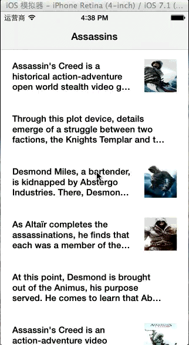

LCVesper
========

A demo app with [Vesper](https://itunes.apple.com/cn/app/vesper/id655895325?mt=8)‘s view transition and cell moving effect.

Many thanks to yeahdongcn's [RSTransitionEffect](https://github.com/yeahdongcn/RSTransitionEffect) and Ray Wenderlich's [tutorial](http://www.raywenderlich.com/63089/cookbook-moving-table-view-cells-with-a-long-press-gesture).

Here's the effect gif:

